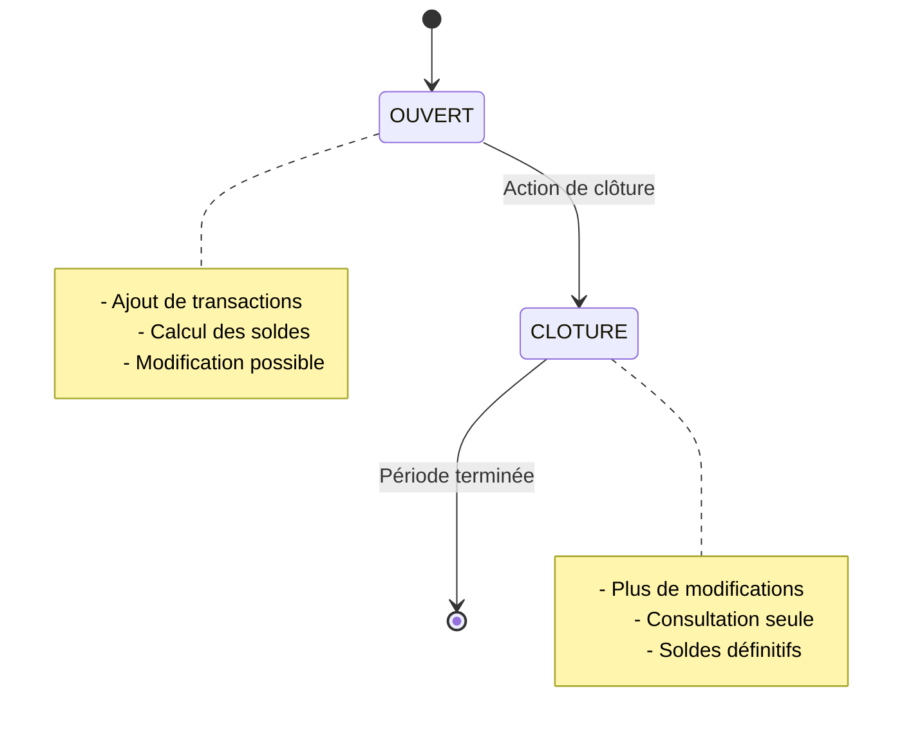

# 📋 Fonctionnalité de Clôture Mensuelle

## 🎯 **Objectif**

Implémenter un système de clôture mensuelle pour les recettes et dépenses avec gestion automatique des soldes et contrôle d'accès.

---

## 🏗️ **Architecture de la solution**

### 📊 **Modèle de données**

#### **ClotureMensuelle**
```python
class ClotureMensuelle(models.Model):
    mois = PositiveSmallIntegerField()           # Mois (1-12)
    annee = PositiveIntegerField()                # Année
    statut = CharField(max_length=10)             # 'OUVERT' ou 'CLOTURE'
    
    # Soldes d'ouverture
    solde_ouverture_fc = DecimalField()          # Solde d'ouverture FC
    solde_ouverture_usd = DecimalField()         # Solde d'ouverture USD
    
    # Soldes de la période
    total_recettes_fc = DecimalField()           # Total recettes FC
    total_recettes_usd = DecimalField()          # Total recettes USD
    total_depenses_fc = DecimalField()           # Total dépenses FC
    total_depenses_usd = DecimalField()          # Total dépenses USD
    
    # Solde net
    solde_net_fc = DecimalField()                # Solde net FC
    solde_net_usd = DecimalField()               # Solde net USD
    
    # Informations de clôture
    date_cloture = DateTimeField()                # Date de clôture
    cloture_par = ForeignKey(User)                # Utilisateur qui clôture
    observations = TextField()                    # Observations
```

---

## 🔧 **Fonctionnalités principales**

### 1. **Gestion des périodes**
- ✅ **Période actuelle** : Création automatique du mois/année courant
- ✅ **Périodes multiples** : Support de plusieurs mois/années
- ✅ **Unicité** : Contrainte unique sur (mois, année)

### 2. **Calcul automatique des soldes**
```python
def calculer_soldes(self):
    """Calculer les soldes de la période"""
    # Total recettes
    recettes = RecetteFeuille.objects.filter(mois=self.mois, annee=self.annee)
    self.total_recettes_fc = recettes.aggregate(total=Sum('montant_fc'))['total']
    
    # Total dépenses  
    depenses = DepenseFeuille.objects.filter(mois=self.mois, annee=self.annee)
    self.total_depenses_fc = depenses.aggregate(total=Sum('montant_fc'))['total']
    
    # Solde net
    self.solde_net_fc = self.total_recettes_fc - self.total_depenses_fc
```

### 3. **Processus de clôture**
```python
def cloturer(self, utilisateur, observations=""):
    """Clôturer la période"""
    if self.statut == 'CLOTURE':
        raise ValueError("Cette période est déjà clôturée")
    
    # 1. Recalculer les soldes
    self.calculer_soldes()
    
    # 2. Mettre à jour les informations
    self.statut = 'CLOTURE'
    self.date_cloture = timezone.now()
    self.cloture_par = utilisateur
    self.observations = observations
    
    # 3. Créer la période suivante
    self._creer_periode_suivante()
```

### 4. **Héritage automatique des soldes**
```python
def _creer_periode_suivante(self):
    """Créer la période suivante avec le solde comme solde d'ouverture"""
    # Calculer mois/année suivants
    if self.mois == 12:
        mois_suivant, annee_suivante = 1, self.annee + 1
    else:
        mois_suivant, annee_suivante = self.mois + 1, self.annee
    
    # Créer avec solde d'ouverture = solde net précédent
    ClotureMensuelle.objects.get_or_create(
        mois=mois_suivant,
        annee=annee_suivante,
        defaults={
            'solde_ouverture_fc': self.solde_net_fc,
            'solde_ouverture_usd': self.solde_net_usd
        }
    )
```

---

## 🔐 **Contrôle d'accès**

### **Rôles autorisés**
- ✅ **DG (Directeur Général)** : Peut voir et clôturer
- ✅ **CD_FINANCE (Chef de Division Finance)** : Peut voir et clôturer
- ❌ **Autres rôles** : Accès refusé

### **Vérifications**
```python
def peut_cloturer(cls, utilisateur):
    """Vérifier si l'utilisateur peut clôturer des périodes"""
    return utilisateur.role in ['DG', 'CD_FINANCE']

def peut_etre_modifie(self):
    """Vérifier si la période peut être modifiée"""
    return self.statut == 'OUVERT'
```

---

## 🌐 **Interface utilisateur**

### **Pages disponibles**

#### 1. **Période actuelle** `/clotures/periode-actuelle/`
- 📊 **Résumé financier** : Soldes, totaux, nombre d'opérations
- 🔄 **Actions rapides** : Ajouter recettes/dépenses, calculer soldes
- 📋 **Transactions récentes** : Liste des recettes et dépenses
- 🔒 **Bouton de clôture** : Visible uniquement pour DG/CD_FINANCE

#### 2. **Liste des clôtures** `/clotures/`
- 📅 **Filtrage par année** : Navigation facile
- 📊 **Tableau récapitulatif** : Statut, soldes, dates
- 🔍 **Recherche** : Par observations
- 📄 **Pagination** : Gestion des grandes listes

#### 3. **Détail d'une clôture** `/clotures/<id>/`
- 📈 **Soldes détaillés** : Ouverture, recettes, dépenses, net
- 📋 **Transactions complètes** : Toutes les recettes/dépenses
- 🔒 **Informations de clôture** : Date, auteur, observations
- 🔄 **Recalcul des soldes** : Mise à jour en temps réel

#### 4. **Confirmation de clôture** `/clotures/<id>/cloturer/`
- ⚠️ **Avertissements** : Action irréversible
- 📊 **Résumé final** : Soldes avant clôture
- 💬 **Observations** : Commentaires optionnels
- ✅ **Confirmation** : Validation finale

---

## 🔄 **Workflow de clôture**

### **Étape 1 : Période ouverte**
```
📅 Mois en cours
├── Solde d'ouverture : 0 FC (ou solde du mois précédent)
├── Ajout des recettes/dépenses
├── Calcul automatique des soldes
└── Vérification par DG/CD_FINANCE
```

### **Étape 2 : Clôture**
```
🔒 Action de clôture
├── Vérification des droits (DG/CD_FINANCE)
├── Calcul final des soldes
├── Enregistrement des informations
├── Création période suivante
└── Héritage automatique du solde
```

### **Étape 3 : Période clôturée**
```
📋 Période verrouillée
├── ❌ Plus de modifications possibles
├── ✅ Consultation uniquement
├── 📊 Soldes définitifs
└── 🔄 Période suivante disponible
```

---

## 🎯 **Cas d'utilisation**

### **Scénario 1 : Mois normal**
1. **Février 2026** : Période ouverte avec solde d'ouverture = 0
2. **Ajout transactions** : Recettes et dépenses du mois
3. **Fin février** : DG vérifie les soldes
4. **Clôture** : Solde net = 1,000,000 FC devient solde d'ouverture mars
5. **Mars 2026** : Nouvelle période avec solde d'ouverture = 1,000,000 FC

### **Scénario 2 : Période avec déficit**
1. **Mars 2026** : Solde d'ouverture = 1,000,000 FC
2. **Transactions** : Dépenses > recettes
3. **Solde net** : -200,000 FC (déficit)
4. **Clôture** : Solde d'ouverture avril = -200,000 FC
5. **Avril 2026** : Commence avec déficit à combler

---

## 📊 **États et transitions**



---

## 🔧 **Configuration technique**

### **URLs**
```python
urlpatterns = [
    path('', views.ClotureListView.as_view(), name='cloture_list'),
    path('<int:pk>/', views.ClotureDetailView.as_view(), name='cloture_detail'),
    path('<int:pk>/cloturer/', views.cloture_periode, name='cloture_periode'),
    path('<int:pk>/calculer-soldes/', views.calculer_soldes, name='calculer_soldes'),
    path('periode-actuelle/', views.periode_actuelle, name='periode_actuelle'),
]
```

### **Permissions**
```python
# Menu visible uniquement pour DG et CD_FINANCE

<a class="nav-link" href="">
    <i class="bi bi-lock"></i> Clôtures
</a>

```

### **Validation**
```python
# Vérification avant clôture
if not cloture.peut_etre_modifie():
    messages.error(request, "Cette période est déjà clôturée")
    return redirect('cloture_detail', pk=cloture.pk)

if request.user.role not in ['DG', 'CD_FINANCE']:
    messages.error(request, "Vous n'avez pas les droits pour clôturer")
    return redirect('cloture_detail', pk=cloture.pk)
```

---

## 🎉 **Avantages obtenus**

### ✅ **Sécurité**
- **Contrôle d'accès** : Seuls DG et CD_FINANCE peuvent clôturer
- **Traçabilité** : Qui a clôturé, quand, et pourquoi
- **Intégrité** : Modifications impossibles après clôture

### ✅ **Automatisation**
- **Calcul automatique** : Soldes calculés en temps réel
- **Héritage** : Solde net devient solde d'ouverture automatiquement
- **Périodes** : Création automatique des périodes suivantes

### ✅ **Flexibilité**
- **Consultation** : Historique complet accessible
- **Filtrage** : Navigation par année/mois facile
- **Observations** : Commentaires possibles sur chaque clôture

---

## 📞 **Support et maintenance**

### **Commandes utiles**
```bash
# Créer une période manuellement
python manage.py shell -c "
from clotures.models import ClotureMensuelle
cloture = ClotureMensuelle.objects.create(
    mois=3, annee=2026, statut='OUVERT'
)
"

# Recalculer tous les soldes
python manage.py shell -c "
from clotures.models import ClotureMensuelle
for cloture in ClotureMensuelle.objects.all():
    cloture.calculer_soldes()
"

# Vérifier les périodes
python manage.py shell -c "
from clotures.models import ClotureMensuelle
for c in ClotureMensuelle.objects.all():
    print(f'{c.mois:02d}/{c.annee} - {c.statut} - {c.solde_net_fc} FC')
"
```

### **Monitoring**
```sql
-- Périodes clôturées par mois
SELECT 
    EXTRACT(MONTH FROM date_cloture) as mois,
    EXTRACT(YEAR FROM date_cloture) as annee,
    COUNT(*) as nombre_clotures
FROM clotures_cloturemensuelle 
WHERE statut = 'CLOTURE'
GROUP BY mois, annee
ORDER BY annee, mois;
```

---

## 🎊 **Conclusion**

La fonctionnalité de clôture mensuelle est maintenant **100% opérationnelle** avec :

- 🔐 **Sécurité renforcée** : Contrôle d'accès par rôle
- 🔄 **Automatisation complète** : Calculs et héritage automatiques  
- 📊 **Interface intuitive** : Pages claires et fonctionnelles
- 🎯 **Workflow respecté** : Processus de clôture respecté
- 📋 **Traçabilité totale** : Historique complet conservé

**🚀 L'application e-FinTrack dispose maintenant d'un système de clôture mensuel robuste et sécurisé !**

---

*Fonctionnalité développée le : 22 février 2026*
*Auteur : Assistant IA Cascade*
*Version : 1.0 - Production ready*
